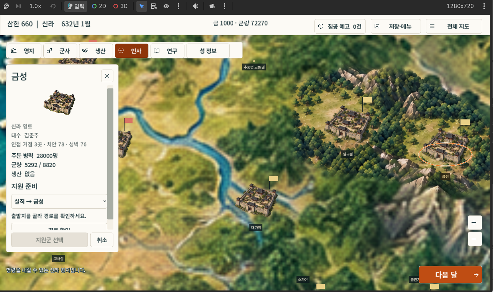
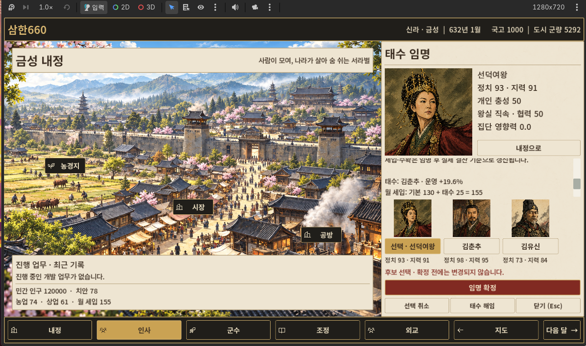

# V1 화면 검수 근거

2026-09-28 사용자가 제공한 캡처 두 장을 직접 확인했다. 실제 게임 실행, 코드 조회, 입력·저장 동작은 이 검수에서 수행하지 않았다. 아래 문제는 시각 관찰과 추가 확인 대상을 구분해 기록한다.

## 1. 지도·도시 선택

지도와 금성 정보·지원 준비 패널이 보이며 인사 탭이 선택되어 있다. 농업·상업 명령이 열린 내정 기본 화면은 아니다. 이 한 장으로 메뉴 전환의 정상 여부를 판정하지 않는다. 지도는 이번 디자인 교체 범위 밖이며, 다른 화면과의 테마 통일은 후속 고려 대상이다.

## 2. 태수 후보 선택

도시 약 65%와 업무 약 35%의 구도, 채색 전경, 어두운 상하단, 금색 선택, 붉은 주 버튼이 반영되어 있다.

| 관찰 | 판단과 후속 조치 |
| --- | --- |
| 선택 후보는 선덕여왕, 아래 태수·세입은 김춘추 기준으로 표시 | 현재와 후보의 소유자를 명확히 표기하고 예상 변화와 분리 |
| 초상 아래 설명문이 일부 잘려 보임 | 실제 화면에서 스크롤 위치와 영역 경계를 재현·수정 |
| 큰 초상이 정사각형 칸에 배치되고 이름·능력·정치 정보 크기가 비슷함 | 기존 초상의 비중과 글자 위계를 조정 |
| 임명 확정이 얇고 보조 버튼과 가까움 | 주 버튼을 강조하고 해임은 별도 행동으로 구분 |
| 군주인 선덕여왕이 선택 가능한 후보로 보임 | 기존 임명 규칙 확인 필요. 캡처만으로 오류나 금지 대상이라고 단정하지 않음 |
| 집단 영향력 0.0이 표시됨 | 실제 초기 상태일 수 있음. 계산 오류라고 단정하지 않음 |

선택을 색과 문구로 함께 보여주는 점은 유지한다. 글자 잘림은 읽기와 조작 판단에 영향을 준다. 키보드 포커스, 클릭 범위, 대비의 정확한 수치, 저장 일관성은 캡처만으로 확인되지 않았다.

## 3. 비교 방법과 미검수 상태

승인 시안은 reference/approved_personnel.png 및 reference/domestic_default.png다. 비교할 때 화면 안의 실제 게임 상태와 디자인 요소를 구분한다. 시안의 가상 수치를 게임에 적용하지 않는다.

미검수: 내정 기본 명령 화면, 담당자 선택, 임명 성공 후 상태, 후보 목록이 많은 경우, 빈 후보, 월 완료, 취소·반복 실행, 저장·복원, 1920×1080의 실제 실행 화면.

VS_CODE_TASK.md에 실제 확인·수정 순서를 정리했다.
