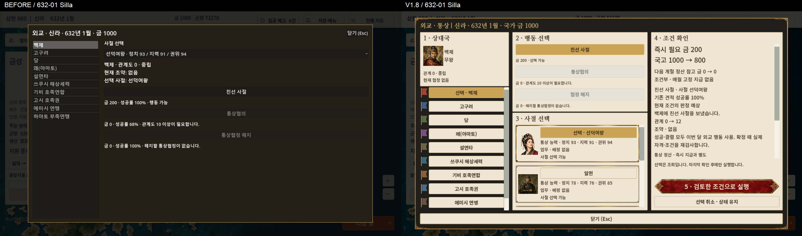
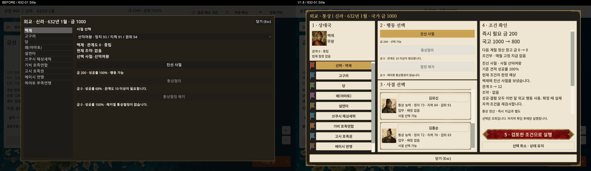
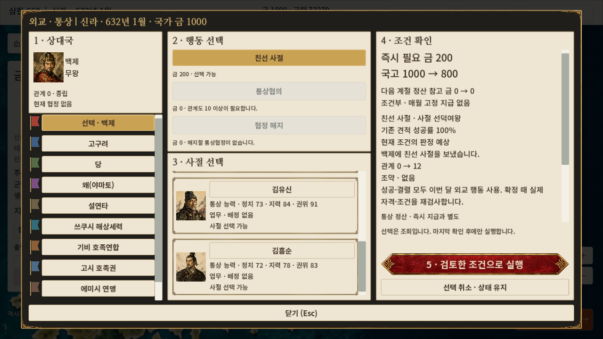
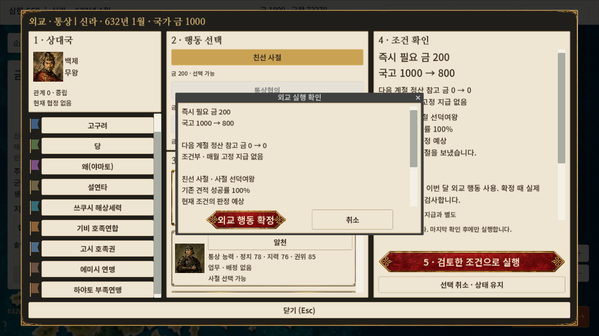
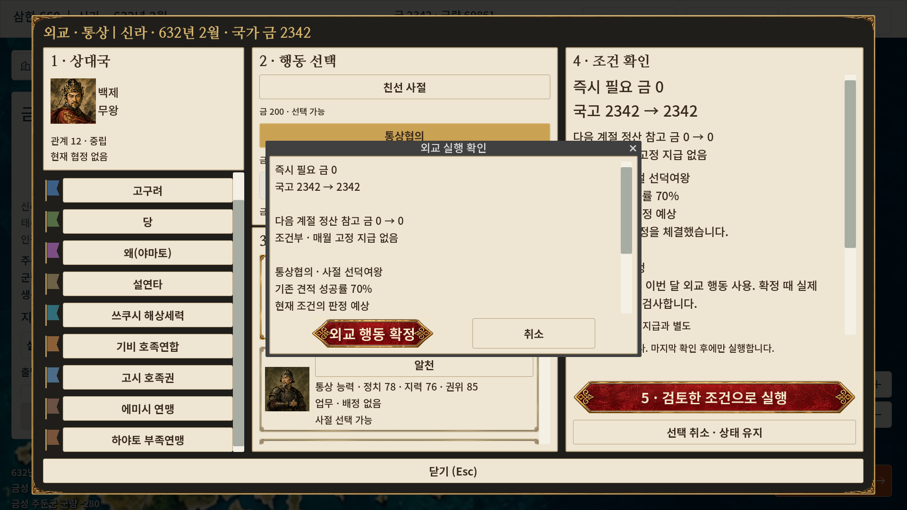
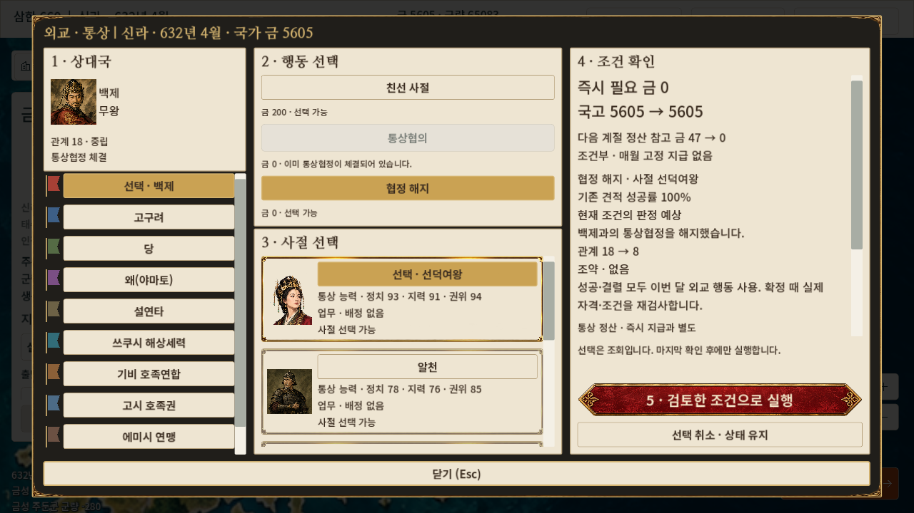
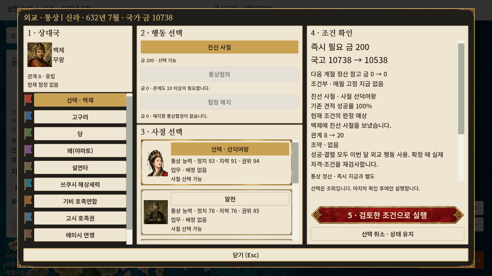
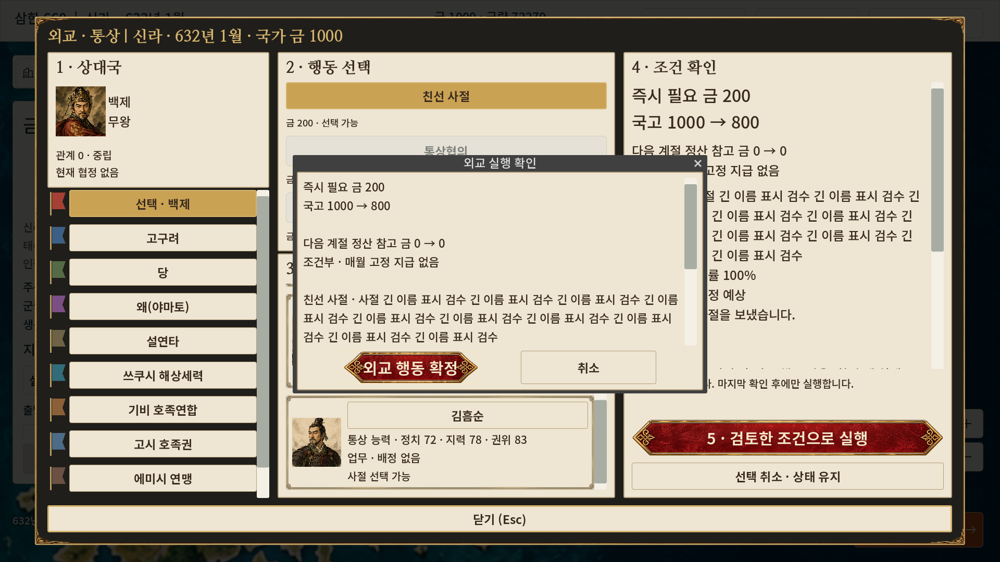

# V1.8 외교·통상 UI 개선 및 Windows 실행본 검증

2026-09-30. 현재 worktree의 미커밋 V1.7 후속 작업 위에 적용했다. 브랜치는 실제 조회 결과 `main`, HEAD는 `1dbe7e6546dfb05af9a21a54cf0a3cc3ae8956b5`이다. 디렉터리 이름과 브랜치 이름을 혼동하지 않았으며 브랜치를 변경하지 않았다. 해당 worktree와 상위 경로에 AGENTS.md는 없었다. 기존 외교 보고서 `DIPLOMACY.md`, V1.7·Windows export 보고서와 실제 연결 코드를 확인했다.

## 구현 범위

| 파일 | 이번 변경 |
|---|---|
| `campaign_main.gd` | 새 외교 UI 연결, 실제 소속 인물과 기존 사절 자격 검사를 이용한 조회 전용 후보 목록 추가 |
| `ui/living_city_v1/diplomacy_overlay.gd` | 기존 외교 overlay를 상속하여 국가 → 행동 → 사절 → 조건 → 확인창의 순서로 재구성 |
| `ui/living_city_v1/diplomacy_preview.gd` | 기존 견적·실행·교역 정산을 분리된 deep copy에서 조회. 원본 상태 변경 없음 |
| `ui/living_city_v1/faction_flag.gd` | 기존 지도 세력색을 사용하는 코드 기반 게임용 깃발 |

원본 `diplomacy_overlay.gd`, `samhan_strategy_systems.gd`의 규칙·비용·판정식과 저장 형식은 변경하지 않았다. 기존 내정 파일과 65:35 배치도 변경하지 않았다. 기존 Living City 프레임·제목 폰트·초상·후보 카드·금색 선택·붉은 확정 버튼을 재사용했다. 역사적 국기 자산은 확인되지 않아 지도 세력색의 게임용 깃발로 표시하며 툴팁에도 명시했다.

실제 시나리오 국가 목록, 군주 관직 연결, 관계·조약을 읽는다. 사절 카드는 등록된 인물의 정치·지력·권위, 현재 업무와 기존 자격 검사 사유를 표시한다. 후보를 선택해도 재고·국고·관계·업무를 바꾸지 않는다. 후보/국가 목록과 조건 영역은 내부 스크롤이다. 긴 인물 이름은 카드 툴팁과 줄바꿈 확인창으로 읽을 수 있다.

현재 캠페인에서 연결된 `gift`, `trade_pact`, `cancel_trade_pact`만 노출한다. 국가·행동·사절 변경 시 견적을 다시 읽고, 마지막 확인창에서만 기존 `request_diplomatic_action()`을 호출한다. 취소·닫기는 실행하지 않는다. 확인 처리 전에 pending 값을 비워 같은 신호의 중복 비용·효과를 막는다.

## 비용과 통상 안내의 근거

- 즉시 비용과 국고 전후는 기존 견적 및 실행 결과의 `gold_cost`를 사용한다.
- 성공률은 기존 견적 값이다. ‘현재 조건의 판정 예상’은 기존 결정적 판정 함수를 복제 상태에 실행한 결과이며 새 확률 공식을 추가하지 않았다. 실제 확정 시 자격·월 제한·잔액 등을 재검사한다.
- 통상 참고액은 기존 `_process_trade()`를 복제 상태와 실제 도시 데이터에 실행하여 얻는다. UI에 수입 계산식을 만들지 않았다.
- 실제 캠페인은 **계절 전환월(1·4·7·10월)**에 교역을 정산한다. 협정 체결만으로 매월 금이 지급되거나 교역로가 생성되지 않는다. 협정·비전쟁·활성 경로·도시·시장·위험도 유지에 따라 달라지는 조건부 금액으로 표시한다.
- 교역로 개설 UI는 기존에도 미연결이며 이번에 추가하지 않았다. 검증에서는 실제 금성·사비 시장과 협정을 사용하여 기존 `open_trade_route()` 명령을 호출했다. 이를 사용자 UI로 개설한 것으로 기록하지 않는다.

## 검증 환경과 재현

Windows 11 x86_64, NVIDIA GeForce RTX 4060 Laptop GPU. Godot `4.7.2.stable.official.ed1daf0bf`, 일치하는 `4.7.2.stable` Windows x86_64 release template, `Windows Desktop` 프리셋 사용. 템플릿 SHA512 검증 후 빌드했다.

소스 복사본: `%LOCALAPPDATA%/Temp/Samhan660_Windows_V1_8_20260930/source`.
배포 파일만 있는 검수 경로: 같은 폴더의 `play-copy/Samhan660.exe`.
Godot 편집기 프로세스가 없는 상태에서 실행했다. 별도 PC가 아니라 **동일 PC의 독립 배포 폴더**다.

재현 스크립트는 `living_city_v1_8_review/build_windows.ps1`, `run_export.ps1`, `runtime_qa.gd`, `base_qa.gd`에 보존했다. QA autoload는 빌드 복사본에만 추가한다. 원본 `project.godot`의 기존 변경은 그대로 보존했다. 일반 실행에서는 QA 노드가 즉시 제거되며 자동 저장·검사가 시작되지 않는다.

```powershell
# 배포 폴더에서 phase별로 새 프로세스를 실행한다. out은 동일한 증거 폴더를 사용한다.
.\Samhan660.exe --log-file C:/Temp/v18/prepare.log -- --qa-v1-8 --phase=prepare --out=C:/Temp/v18
.\Samhan660.exe --log-file C:/Temp/v18/reload.log -- --qa-v1-8 --phase=reload --out=C:/Temp/v18
.\Samhan660.exe --log-file C:/Temp/v18/cancel-reload.log -- --qa-v1-8 --phase=cancel-reload --out=C:/Temp/v18
# 기존 회귀: Godot.exe --headless --path <project-copy> --script res://tests/diplomacy_test.gd
```

## 실제 검사 결과

이번에 직접 실행한 최종 기록은 **344개 검사, 실패 0개**다. 캡처 저장·자산 로딩 검사도 포함된 assertion 수이며 서로 다른 기능 344개라는 의미는 아니다. 과거 V1.7의 349개 및 이전 export 결과는 합산하지 않았다. 개발 중 반복 실행도 중복 합산하지 않았다.

| 실행 범위 | 검사 | 실패 | 증거 |
|---|---:|---:|---|
| 기존 외교 headless 회귀 | 132 | 0 | `living_city_v1_8_review/project/regression-final.log` |
| 프로젝트 GUI: 처리 / 협정 복원·해지 / 해지 복원 | 58 + 21 + 9 = 88 | 0 | `living_city_v1_8_review/project/*-result.json` |
| 최종 Windows EXE: 처리 / 협정 복원·해지 / 해지 복원 | 71 + 33 + 20 = 124 | 0 | `living_city_v1_8_review/final-export/*-result.json` |

프로젝트 GUI의 초기 51개 및 버튼 수정 전 실행본 121개는 위 합계에서 제외했다. 마지막 대화상자 폭 수정은 최종 EXE 124개에 포함해 검증했다. 실행본의 세 프로세스 PID는 28268 / 39248 / 32312이며 모두 종료 코드 0이다. 최종 로그에 SCRIPT ERROR·ERROR·FAIL이 없었다. QA 인수 없는 일반 실행도 별도로 시작·종료해 엔진/렌더러 로그를 확인했다(위 assertion 수에 더하지 않음). `git diff --check`에 공백 오류가 없었다.

실제 Godot 창에서 1280×720·1920×1080 캡처, 국별 선택, Tab·Shift+Tab 이동, Space로 선택·확정, Esc 닫기, 후보 내부 스크롤, 지도 선택·월 버튼 복구를 검사했다. 확인창 Space는 해당 Window에 입력 이벤트를 전달했다. 취소는 실제 canceled 처리 경로를 호출했다. OS 전역 물리 키보드/마우스로 모든 조합을 수동 재검사한 것은 아니다.

정상 632년 신라 신규 캠페인에서 친선 사절(금 200·관계 +12), 다음 달 통상협의, 기존 교역로 명령, 새 기본 `user://` 슬롯 저장을 실행했다. 종료·새 프로세스 복원 후 연월·국고·도시·전체 strategy snapshot을 비교했다. 일반 월의 교역 지급 없음, 계절 전환의 교역 금 47, 해지 예상액 0과 실제 해지, 다시 저장·종료·복원 후 다음 계절까지 교역 금 증가 없음까지 검사했다. 월 행동 제한과 중복 요청·중복 확인 신호도 상태를 바꾸지 않았다.

업무 충돌은 실제 내정 작업 시작을 이용했다. 잔액 199, 매우 긴 이름·추가 표시 목록, 후보 없음은 **별도 경계 조건 fixture**로 구성하고 자체 baseline 저장에서 복원했다. 이 조작된 상태를 정상 캠페인 저장·복원 결과로 사용하지 않았다.

발견한 UI 문제는 확인창의 짧은 붉은 버튼이 장식을 압축하는 현상이었다. 최소 크기만 지정해도 대화상자가 폭을 재설정해, 확인 문구와 대화상자 버튼 최소 폭·높이 설정을 함께 수정했다. 최종 실행본에서 실제 폭 검사와 캡처로 재확인했고 통과했다.

## 보존·미검증·후속 작업

시작 시 저장 관련 JSON은 기존 207개와 이전 검수 슬롯을 포함해 실제 **228개**였다. 각 파일의 SHA256 비교 결과 모두 보존됐다. 보호 문서와 기존 Windows ZIP 3개도 일치했다. 기존 source baseline에서 변경된 파일은 의도한 `campaign_main.gd` 하나이며 새 UI 스크립트 3개를 추가했다. 최종 manifest와 빌드 소스의 차이는 빌드 전용 QA autoload를 넣은 `project.godot`뿐이다. 증거: `living_city_v1_8_review/preservation.json`, `save-start.json`, `protected-start.json`, `source-start.json`, `source-final.json`. Git 변경 명령과 커밋은 실행하지 않았다.

실행 ZIP에는 EXE·PCK·라이선스 5개·실행 안내·다른 PC 검수표·빌드 정보·소스/자산 SHA256 목록을 포함한다. 원본 배경, 테스트 저장, 개발 로그, 프로젝트 소스 자체는 별도로 배포하지 않는다. 압축된 데이터 항목 11개의 해시를 원본과 비교해 일치했다(SHA256SUMS 자체는 자기 해시 검사에서 제외). 작은 검토 ZIP은 이 보고서와 선택한 캡처만 포함한다.

## 전달물과 캡처

- 실행 파일: **Samhan660.exe**. ZIP 전체를 새 폴더에 풀고 실행한다.
- 실행 ZIP: `C:/Users/지용훈/Downloads/Samhan660_Windows_V1_8_20260930.zip` — 490,269,638 bytes, **467.56 MiB**.
- ZIP SHA256: `327DF6201D2F1B31E1DE0E4A74EDC00E6732EBE2CD88910A2F917294FD9F1AE9`.
- PCK SHA256: `47A6D92B18711A93AFF40F7804F8F5FC58CC13DCF1164F1AD80B40E56F6D5C91`.
- 소스/자산 manifest SHA256: `F6EE0DFD64DE42BDDE9FC45F9DA88C13DB4EDDE75BCF98F9FD2181309020B5BF`.
- 검토 ZIP: `tests/Samhan660_Living_City_UI_V1_8_Review_20260930.zip`.

전후 비교는 같은 632년 1월 신라, 금 1000, 백제 관계 0의 실제 화면을 좌우 동일 픽셀 크기로 배치했다. 이전은 기존 프로젝트 UI, 이후는 최종 Windows 실행본이다. 캡처는 재사용한 과거 버전 이미지가 아니라 이번 작업의 변경 전/후 실제 실행 결과다.










다른 Windows PC에서 **V1.8 빌드**를 검증하지 못했다. 실제 Windows DPI 배율 변경 검증도 이번 범위에서는 수행하지 않았다. 화면 크기 변경을 DPI 검증으로 주장하지 않는다. 전달 검수표는 `living_city_v1_8_review/OTHER_PC_CHECKLIST.md`에 있다.

다음 우선순위는 ① 동일 V1.8 ZIP의 다른 PC 실행·입력·새 슬롯 복원 ② 실제 Windows 배율별 표시·클릭 점검 ③ 필요 시 기존 규칙을 사용하는 교역로 개설 UI의 별도 설계다.

### 바로 전달할 VS Code 지시문

> V1.8 다른 PC·DPI 후속 검수를 진행해라. AGENTS.md 존재 여부와 tests/LIVING_CITY_UI_V1_8.md, 실행 ZIP의 BUILD_INFO 및 SHA256을 확인해라. 기존 미커밋 작업·저장·ZIP을 보존하고 Git 변경 명령은 실행하지 마라. 기존 V1.8 ZIP으로 별도 Windows PC에서 632년 신라의 외교 진입→친선→다음 달 협정→새 슬롯 저장→종료·재실행 복원을 검증해라. 실제 Windows 배율 100·125·150%와 게임 창 크기를 각각 기록하고 변경 설정을 복원해라. 상대국·사절 선택, 비용, 취소·Esc·Tab·Shift+Tab·확정, 스크롤과 지도 입력 복구를 확인해라. 다른 PC가 없으면 미검증으로 남겨라. 문제와 영향 범위만 수정·재검증하고 변경이 없으면 실행 ZIP을 다시 만들지 마라. 보고서·대표 캡처를 작은 검토 ZIP으로 제공해라. 기존 검사를 새 실행 결과처럼 합산하지 말고 커밋하지 마라.
