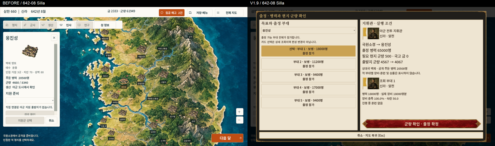
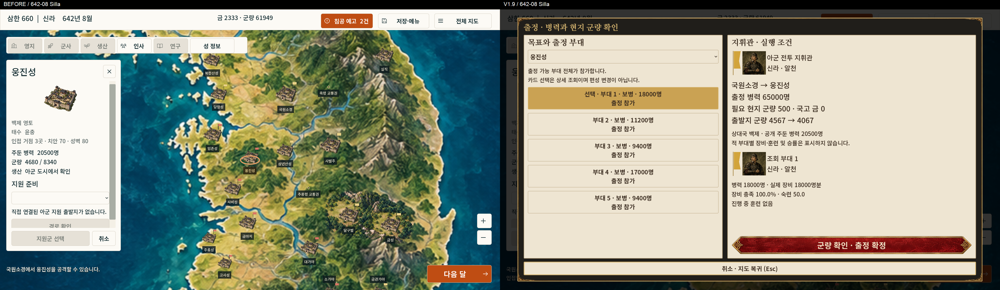
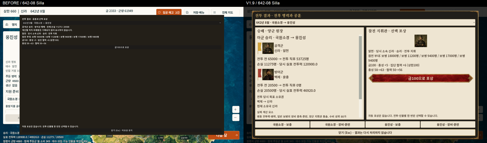
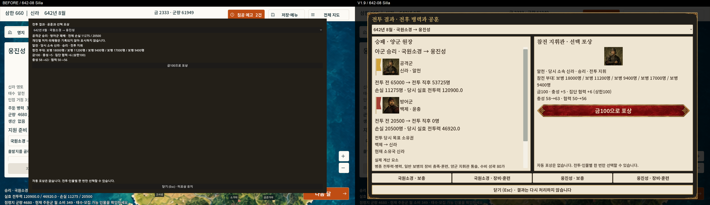
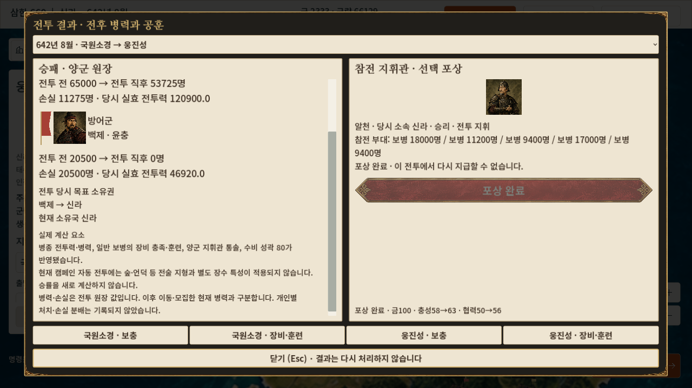
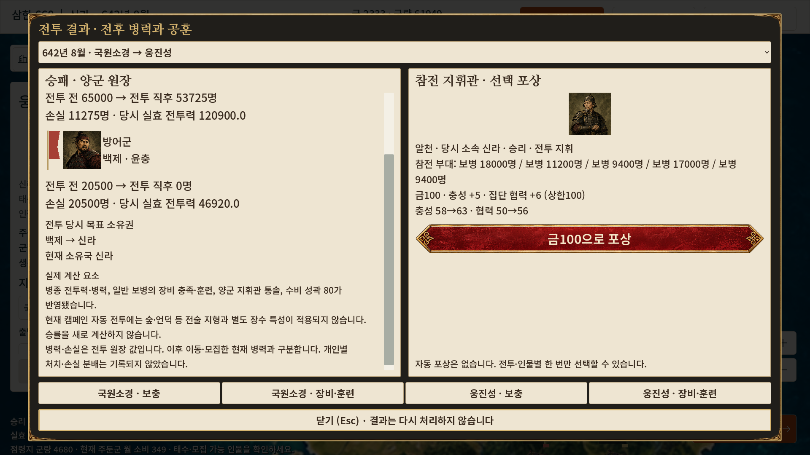
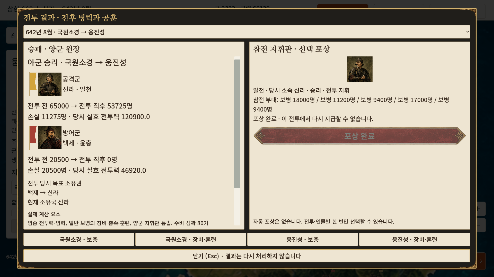
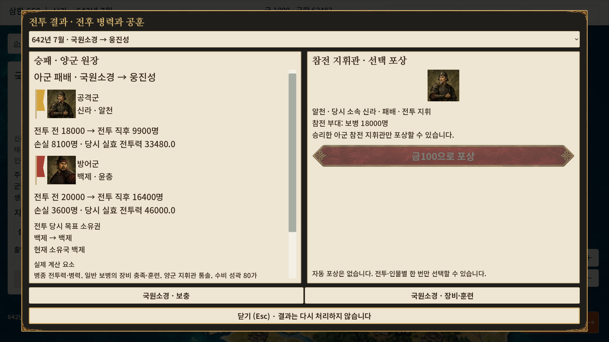

# V1.9 출정·전투 결과·전후 처리 UI

2026-10-01. 현재 worktree의 미커밋 통합본에 적용했다. 실제 브랜치는 `main`이며 임의로 변경하지 않았다. HEAD는 `1dbe7e6546dfb05af9a21a54cf0a3cc3ae8956b5`이다. worktree와 상위 경로에 AGENTS.md가 없음을 확인했다. stage·commit·push·merge·reset·clean은 실행하지 않았다.

## 기존 연결 조사와 범위

`campaign_main.gd`, `army_readiness.gd`, `battle_overlay.gd`, `battle_merit.gd`, `battle_merit_overlay.gd`, `campaign_ending.gd`와 BATTLE_MERIT_V1·CAMPAIGN_ENDING_V1 및 V1.8 보고서를 대조했다.

실제 캠페인 공격은 도시 선택 → 출정 준비 → 적 도시 선택 → `resolve_attack()` → `resolve_army_battle()` → `Army.combat()` → 기존 연출 → 공훈 결과 경로다. `battle_overlay.gd`의 자유 이동 전술 전장은 이 캠페인 경로에서 사용되지 않는다. 따라서 전술 지형·특성 효과를 현재 전투에 적용된 것처럼 안내하지 않는다.

기존에는 목표 선택 후 공격 버튼이 바로 전투를 실행했다. 이번에는 그 지점에 확인창을 연결했다. **출발 도시의 출정 가능 부대 전체가 참가하는 기존 규칙**을 유지했다. 카드 선택은 상세 조회이며 일부 부대만 출정시키는 기능으로 오인하지 않도록 화면에 명시했다. 부분 출정 규칙을 새로 추가하지 않았다.

결과는 기존 `strategy_state.army.battles`와 전투 당시 양군 스냅샷·손실을 읽는다. 실제 전투는 일반 보병의 장비 충족·훈련, 병종 전투력, 양군 지휘관 통솔과 수비 성곽을 사용한다. 숲·언덕 등 전술 지형, 별도 장수 특성, 새로운 승률은 표시하지 않는다.

## 실제 수정 파일

| 파일 | 변경 |
|---|---|
| `campaign_main.gd` | 출정 확인·새 결과창 연결, 조회용 출정 견적, 출정 중 월 진행 차단, 불러오기·종료 시 출정 모달 정리 |
| `settlement_overlay.gd` | 기존 busy 검사에 새 출정 모달만 추가. 배치·군수 화면 수정 없음 |
| `ui/living_city_v1/battle_style.gd` | 기존 프레임·제목 서체·버튼·지도색 깃발·초상 재사용 |
| `ui/living_city_v1/sortie_overlay.gd` | 목표·부대 조회, 실제 군량·비용·지휘관·장비·훈련·출정 가능 여부, 확정·취소 |
| `ui/living_city_v1/battle_results_overlay.gd` | 기존 공훈 overlay 상속, 양군과 전후 병력·손실·소유권·계산 근거, 기존 회복 화면 연결 |

검증 스크립트·빌드/묶음 스크립트와 증거는 `tests/living_city_v1_9_review/`에 있다. 전투·훈련·공훈·경제 공식과 저장 형식은 수정하지 않았다. 내정 65:35와 기존 군수·편성·훈련 화면 코드는 보존했다.

출정 견적은 `Army.attack_units/count/ratio/training`, 기존 지휘관 선택·업무/군권 검사, `Economy.validate`와 기존 `ATTACK_FOOD_COST`를 읽는다. 실행 직전 다시 조회하며 실제 비용 차감은 기존 명령에서만 발생한다. 군량 부족도 확인창의 확정 버튼 근처에 표시한다. 적 정보는 기존 지도에 공개된 국가·도시 병력만 출정 창에 표시하며 적 세부 장비·훈련과 추정 승률을 노출하지 않는다.

결과의 병력은 **전투 당시** 전후 값이고 현재 병력과 구분된다. 소유권도 전투 당시 변화와 현재 소유국을 나누어 표시한다. 공훈 필드가 없는 과거 기록에 새 자격을 만들지 않는다. 깃발은 V1.8의 지도색 게임용 표현이며 역사적 실물 국기로 주장하지 않는다.

632·642년 신라의 기존 선택 포상은 `Merit.quote/reward`를 그대로 사용한다. 화면에 실제 비용·충성·협력 변화와 불가 사유를 표시하며 자동 보상은 없다. 현재 아군 소유 도시의 보충은 기존 모집, 장비·훈련은 기존 부대 화면으로 이동한다. 캠페인이 종료되면 회복 명령 버튼도 비활성화한다.

## 환경과 재현

Windows 11 x86_64, RTX 4060 Laptop GPU, D3D12 Forward+. Godot `4.7.2.stable.official.ed1daf0bf`, 같은 `4.7.2.stable` Windows x86_64 template와 `Windows Desktop` 프리셋을 사용했다. 기존 템플릿 SHA512를 확인한 뒤 빌드했다.

- 프로젝트 GUI 복사본: `%LOCALAPPDATA%/Temp/Samhan660_V1_9_20261001/source`
- 최종 빌드: `%LOCALAPPDATA%/Temp/Samhan660_Windows_V1_9_20261001`
- 배포 파일 검수: 위 빌드의 `play-copy/Samhan660.exe`

원본 project.godot는 변경하지 않았다. QA autoload는 빌드 복사본에서만 추가하며 `--qa-v1-9` 없이는 즉시 제거된다. 실행본은 EXE·PCK·라이선스만 있는 독립 폴더에서 실행한다. 동일 PC의 다른 폴더이므로 다른 PC 검증으로 기록하지 않는다.

```powershell
# 같은 out 폴더로 각각 새 프로세스를 실행한다.
.\Samhan660.exe --log-file C:/Temp/v19/victory.log -- --qa-v1-9 --phase=victory --out=C:/Temp/v19
.\Samhan660.exe --log-file C:/Temp/v19/defeat.log -- --qa-v1-9 --phase=defeat --out=C:/Temp/v19
.\Samhan660.exe --log-file C:/Temp/v19/reload.log -- --qa-v1-9 --phase=reload --out=C:/Temp/v19
```

자동 재현은 `run_phases.ps1`, `build_windows.ps1`, `runtime_qa.gd`, `base_qa.gd`에 보존했다. 입력 검증은 실제 Godot 창에 viewport 키·마우스 이벤트를 전달하며 일부 선택·후속 화면 연결은 실제 버튼 signal/API를 호출한다. 사람이 모든 조합을 물리 키보드로 수동 플레이한 결과로 표현하지 않는다.

## 정상 전투와 경계 검증 구분

642년 신라·역사·보통, seed 64220260917에서 시작했다. 승리는 실제 기존 이동 명령으로 집결하고 월 진행 후 국원소경→웅진성 출정으로 만들었다. 패배는 별도 신규 캠페인의 기존 병력·장비·지휘관과 적 수비 상태를 그대로 사용해 만들었다. 승패·병력·능력·자원·날짜를 승리/패배에 맞춰 주입하지 않았다. 부대 편성·지휘관 임명·AI 월 처리도 기존 명령을 사용했다.

확인창에서 목표·부대 상세를 바꿔도 전체 상태가 같고, 취소·Esc로 비용이 발생하지 않음을 비교했다. 정상 전투의 군량 500 차감, 전투 원장 1개 추가, 중복 확정 차단, 전투 당시 양군 스냅샷과 수량, 손실 원장 및 전 세계 병력 감소량의 정확한 일치를 확인했다. 승리 점령과 패배 소유권 유지, 포상 비용·중복 방지, 결과 재진입의 무효과도 검사했다.

각 결과를 기본 `user://living_city_v1_9_<phase>_<time>_<pid>.json`의 고유 슬롯에 저장한다. 프로세스 종료 후 새 실행에서 연월·국고·도시·strategy 전체·이동 명령을 비교한다. 포상 기록과 전투 결과를 재열어도 손실·점령·비용이 재적용되지 않는지 확인한다.

군량 0 검사만 명시적 UI 경계 fixture이며 원래 군량으로 복원한 뒤 정상 전투를 실행했다. 종료 검사는 기존 마지막 거점/목표 소유권 fixture와 실제 전투를 사용하는 회귀다. 정상 캠페인 전체 완주라고 주장하지 않는다.

구 공훈 캡처 스크립트는 25개 중 3개가 실패했다. 두 항목은 뒤쪽 전체 지도 잠금만 확인하는 오래된 전제였고 하나는 이전 인사 화면의 상세 문구 경로였다. 변경 전 캡처 증거로만 보존하고 성공 검사 수에 합산하지 않았다. 현재 UI에 맞는 결과·공훈·지도 복구 검증으로 대체했으며 기존 정치 화면 자체는 이번 범위에서 변경하지 않았다.

종료 회귀 원본도 56개 중 ‘새 캠페인 지도 잠금’ 1개가 같은 구 전제로 실패했다. 현재 기본 시작 화면은 도시 지도이므로 `ending_current_ui_test.gd`에서 **보이는 도시 지도의 busy/input_locked**를 검사하고, 도시 화면이 없을 때만 전체 지도 잠금을 검사한다. 나머지 종료 판정·명령 차단·저장 검사는 유지했다. 의도적인 잘못된 저장 경로 검사에서 출력된 저장 실패 ERROR는 재시도 검증의 예상 로그다.

## 미구현·미검증과 후속 우선순위

- 부분 부대 선택 출정과 자유 이동 전술 전장 연결은 이번 범위에서 구현하지 않았다. 기존 캠페인 방식 보존 사항이다.
- 개인별 처치·피해량 원장이 없어 만들어 표시하지 않았다.
- 다른 Windows PC에서 **V1.9 빌드** 실행·복원은 미수행이다. 전달용 `OTHER_PC_CHECKLIST.md`를 제공한다.
- 실제 Windows 배율 변경은 이번에 수행하지 않았다. 720p·1080p 창 크기 검증을 DPI 검증으로 대체해 주장하지 않는다.
- 기존 자동 공훈창 진입 조건(지원 신라 캠페인)은 유지했다. 다른 국가·시나리오의 새 결과 화면은 이번 GUI 정상 사례에 포함하지 않았다. 기존 인사 화면의 참전 이력 조회 동선도 이번에는 별도로 재검증하지 않았다.
- 다음 순서는 ① V1.9 다른 PC·DPI 검수 ② 사용자 조작으로 승리·패배·전후 회복 동선 확인 ③ 필요하면 부분 출정/전술 전장 연계를 별도 기획이다.

## 최종 실제 실행 결과

이번 실행에서 선택한 최종 검사 기록은 **624개, 실패 0개**다. 캡처 저장·자산 로딩 assertion도 포함된 수이며 고유 기능 624개라는 뜻이 아니다. 중간 재시도와 위에 기록한 구 UI 전제 실패 결과는 아래 합계에 중복 포함하지 않았다. 이전 V1.8의 344개와 과거 전투 보고서 수치는 합산하지 않았다.

| 검사 | 이번 결과 | 로그/증거 |
|---|---:|---|
| 부대·전투·훈련·저장 회귀 | 337 / 0 실패 | `living_city_v1_9_review/project/army_readiness_test.log` |
| 기존 공훈·포상 경계 | 32 / 0 실패 | `living_city_v1_9_review/project/battle_merit_test.log` |
| 현재 도시 지도 기준으로 보완한 종료 회귀 | 56 / 0 실패 | `living_city_v1_9_review/final-project/ending.log` |
| 프로젝트 GUI 승리 / 패배 / 별도 프로세스 복원 | 39 + 34 + 10 = 83 / 0 실패 | `living_city_v1_9_review/final-project/*-result.json` |
| 최종 Windows EXE 승리 / 패배 / 별도 프로세스 복원 | 50 + 45 + 21 = 116 / 0 실패 | `living_city_v1_9_review/release-export/*-result.json` |

프로젝트 GUI 이후의 부대 번호 표시 문구와 최소 병력 조회 조건 정렬까지 **최종 실행본 116개**에 포함해 확인했다. 세 실행본 프로세스는 각각 종료 코드 0이며 PID·종료 시각은 `release-export/processes.json`에 있다. 최종 GUI/export 검수 로그에 SCRIPT ERROR·FAIL이 없었다.

| 정상 사례 | 공격 전 → 직후 | 수비 전 → 직후 | 손실 공격 / 수비 | 목표 소유권 |
|---|---:|---:|---:|---|
| 642년 8월 신라 국원소경→웅진성 승리 | 65,000 → 53,725 | 20,500 → 0 | 11,275 / 20,500 | 백제→신라 |
| 별도 신규 캠페인의 같은 경로 패배 | 18,000 → 9,900 | 20,000 → 16,400 | 8,100 / 3,600 | 백제 유지 |

양쪽 모두 실제 출발 도시 군량 500을 한 번만 지불했다. 승리의 선택 포상은 기존 금100 견적을 사용했고 완료 후 중복 요청은 국고·관계·원장을 바꾸지 않았다. 저장 복원은 기본 사용자 경로에서 수행했으며 우회 userdir을 사용하지 않았다.

## 보존과 비교 캡처

작업 시작에 실제 저장 관련 JSON은 **235개**였다. 요청의 228개와 V1.8에서 추가한 검수 슬롯도 포함해 전체 파일을 해시 기준으로 보존했다. 보호 문서와 이전 ZIP 등 **26개 파일**도 SHA256이 일치했다. 기존 source baseline에서 바뀐 것은 `campaign_main.gd`, `settlement_overlay.gd` 두 파일이며 새 UI 스크립트 세 개를 추가했다. `preservation.json`, `source-start.json`, `source-final.json`, `build-match.json`에 기록했다.

최종 소스/자산 manifest와 빌드 복사본을 비교했다. 의도한 차이는 QA autoload를 추가한 복사본 project.godot, 빌드에서 제외한 addon 자체 테스트 파일 3개다. 그 밖의 소스·자산 불일치는 없었다. 군수·내정 배치·전투·포상·경제 공식 파일은 그대로다.

QA 인수 없는 일반 실행에서도 정상 엔진·D3D12 로그를 확인했다. `git diff --check`에 공백 오류가 없었다. 기존 `domestic_assignment_overlay.gd`의 CRLF 안내만 출력됐으며 해당 파일을 변경하지 않았다.

### 전달 파일

- 실행할 파일: **Samhan660.exe**. ZIP 전체를 새 폴더에 풀고 실행한다.
- 실행 ZIP: `C:/Users/지용훈/Downloads/Samhan660_Windows_V1_9_20261001.zip`
- 크기: **490,281,615 bytes / 약 467.57 MiB**.
- 실행 ZIP SHA256: `25281BDA5746CBB4DDA4BC66F7CC897C055E60DF5075CEA9F651E284647A8530`.
- PCK SHA256: `4405DE84B802002BC1CCB5F24A8C420C9B321E9F48FEE2194164D0C45CF8AFE8`.
- 소스/자산 manifest SHA256: `13A2F7943F0CEEAA20E28FA3017BB2C63C726DD7ADBA558C9E9F3A4A545AEACD`.
- 작은 검토 ZIP: `tests/Samhan660_Living_City_UI_V1_9_Review_20261001.zip` — 이 보고서와 전후·대표 캡처만 포함한다.

실행 ZIP에 EXE·PCK·라이선스 5개·실행 안내·다른 PC 검수표·BUILD_INFO·SOURCE_SHA256·SHA256SUMS를 넣었다. 자기 자신인 SHA256SUMS를 제외한 압축 데이터 11개를 풀어 읽어 원본 SHA256과 일치함을 확인했다. 테스트 저장·대용량 로그·원본 프로젝트는 넣지 않았다. 실제 자산·동적 데이터는 export preset과 기존 PNG export plugin을 통해 PCK에 포함되고 실행본의 자산 로딩 검사와 화면으로 확인했다.

전후 비교는 같은 642년 8월 신라·국원소경→웅진성 정상 승리 조건에서 실제 캡처를 동일 픽셀 크기로 배치했다. 출정의 변경 전 화면은 기존 목표 선택 화면이며 당시에는 별도 확인창이 없었다. 변경 후는 최종 Windows 실행본이다. 이전 검증 자료는 삭제하지 않았다.











### 바로 전달할 VS Code 지시문

> V1.9.1 다른 PC·DPI 및 전후 처리 검수를 진행해라. 현재 worktree·AGENTS.md·tests/LIVING_CITY_UI_V1_9.md와 실행 ZIP의 BUILD_INFO·SHA256을 확인해라. 기존 미커밋 작업·저장·보호 파일·ZIP을 보존하고 Git 변경 명령은 실행하지 마라. 기존 V1.9 ZIP으로 별도 Windows PC에서 출정 미리보기 취소→출정 확정→정상 승리/패배 결과→기존 보충·장비·훈련 연결→새 슬롯 저장·종료·재실행 복원을 검증해라. 실제 Windows 100·125·150% 배율과 게임 창 크기를 따로 기록하고 원래 설정으로 복원해라. 720p·1080p에서 Tab·Shift+Tab·Space·Esc·스크롤·클릭 위치와 현재 보이는 지도의 입력 복구를 확인해라. 다른 PC에 접근할 수 없으면 미검증으로 남겨라. 기존 전투·공훈·종료 규칙을 보존하고 발견한 문제와 영향 범위만 수정·재검증해라. 변경이 없으면 실행 ZIP을 다시 만들지 마라. 보고서·대표 캡처를 작은 검토 ZIP으로 전달하고 이전 검사 수를 새로 실행한 것처럼 합산하지 마라. 커밋하지 마라.
